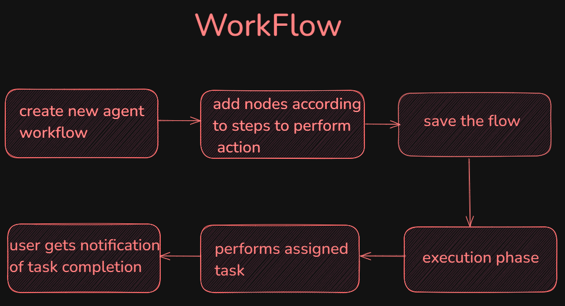

# 🚀 **Easy-Clicks**

Easy-Clicks is an autonomous task management agent that transforms complex operations into intuitive workflows. It allows you to create custom workflows by connecting smart nodes


## 🌍 **Problem Statement**
Digital tasks vary widely and require individual customization, yet many existing systems force users into rigid, one-size-fits-all approaches. This inflexibility often results in wasted time and effort as users work around limitations or adapt workflows manually.  
Creating separate AI platforms for every task is both costly and labor-intensive, making scalability and maintenance challenging.


## 💡 **Our Solution**
**Easy-Clicks** is designed to bridge the gap between manual effort and automation. It allows you to:
- Build flexible workflows by connecting specialized nodes.
- Automate repetitive tasks like web scraping and data processing.
- Seamlessly manage multi-platform communication.  

In essence, Easy-Clicks transforms your workflow into an efficient, automated system tailored to your specific needs.


## 🔎 **Workflow Overview**
The following diagram illustrates the Easy-Clicks workflow:  



1. **Create a new agent workflow** – Start by defining a new workflow.  
2. **Add nodes** – Add smart nodes based on the steps required for your task.  
3. **Save the flow** – Store the configured workflow for future use.  
4. **Execution phase** – The system runs the workflow automatically.  
5. **Task completion** – The workflow executes the assigned tasks.  
6. **Notification** – Users are notified once the task is complete.  


## 🚀 Tech Stack

**Frontend:**  
- Next.js  
- TypeScript  
- Tailwind CSS  

**Backend & Authentication:**  
- Clerk  
- Prisma with Postgres 

## 📦 **Installation**

1. Clone the repository:
```bash
git clone https://github.com/Harshit-Chordiya/Easy-Clicks.git
```

2. Install dependencies:
```bash
npm install
# or
yarn install
# or
bun install
```

3. Set up environment variables:
```bash
cp .env.example .env.local
```

4. Update the `.env.local` file with your credentials:
```env
NEXT_PUBLIC_APP_URL=
NEXT_PUBLIC_CLERK_PUBLISHABLE_KEY=
CLERK_SECRET_KEY=
NEXT_PUBLIC_CLERK_SIGN_IN_URL=
NEXT_PUBLIC_CLERK_SIGN_UP_URL=
NEXT_PUBLIC_CLERK_AFTER_SIGN_IN_URL=
NEXT_PUBLIC_CLERK_AFTER_SIGN_UP_URL=
DATABASE_URL=
```

5. Initialize the database:
```bash
npx prisma generate
npx prisma db push
```

6. Run the development server:
```bash
npm run dev
```

Open [http://localhost:3000](http://localhost:3000) with your browser to see the result.

## 🛠️ Usage

1. Sign up for an account
2. Create a new workflow
3. Add scraping nodes to your workflow
4. Configure scraping parameters
5. Run and monitor your workflow
6. View and export collected data

